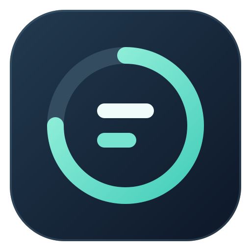
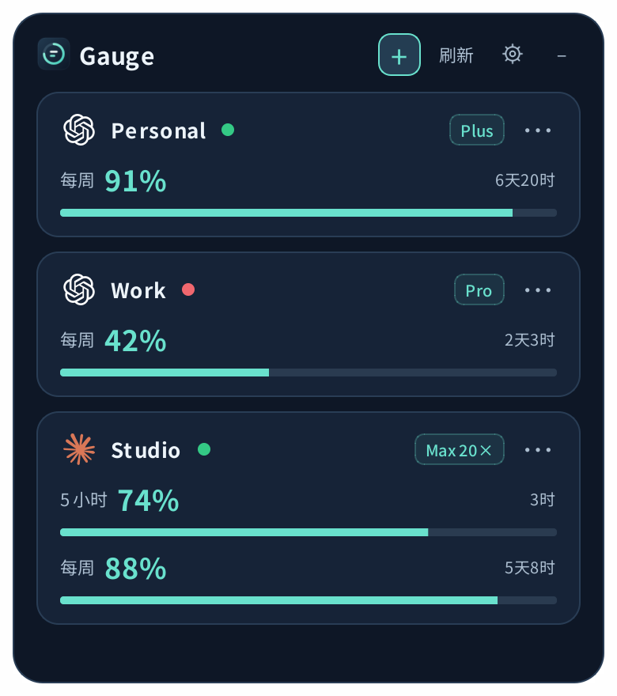
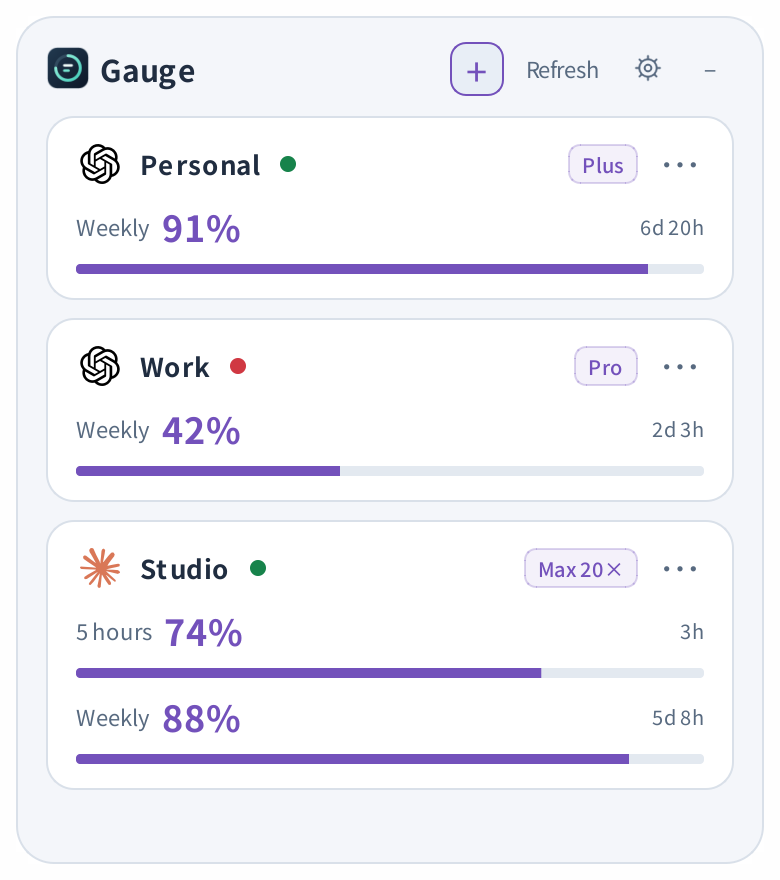
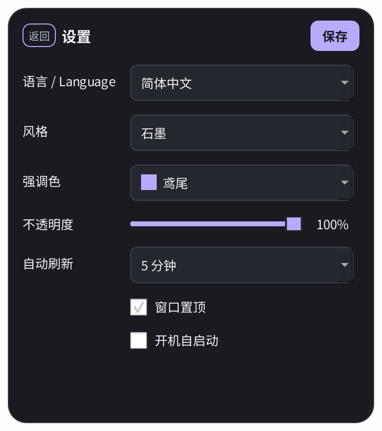

#  Gauge

### 额度还有多少？抬眼就知道。

**Your AI quota, at a glance.**

把 Codex 和 Claude Code 的剩余额度放在桌面一角。哪个账号在用、还能用多少、什么时候重置，一眼看清。留在你的工作界面里，少一次切窗，多一点专注。

[**下载 Windows EXE**](https://github.com/Beellix-dev/Gauge/releases/download/v0.1.0/Gauge-v0.1.0-windows-x64.exe) · [所有版本](https://github.com/Beellix-dev/Gauge/releases) · [源代码](https://github.com/Beellix-dev/Gauge)

Windows 10 / 11 · 多账号 · 中英文 · MIT

## 看一眼 Gauge

  
  
  

真实应用界面，截图中的账号、套餐和额度均为演示数据。

- **账号放一起。** 自动发现本地有效登录，也可以添加多个账号分别监控。
- **窗口由你定。** 自由拖动和缩放，支持置顶、透明度、三种主题与四种强调色。
- **数据留本机。** Gauge 无自建后端；查询通过官方 CLI 或平台服务完成。
- **下载即运行。** 一个 EXE，无需安装 Python；所用平台的官方 CLI 需另行安装。

[开发指南](docs/CONTRIBUTING.md) · [安全说明](docs/SECURITY.md) · [第三方许可](docs/THIRD_PARTY_NOTICES.md)

## 功能

| 功能 | Codex | Claude Code |
| --- | --- | --- |
| 剩余额度 | 每周 | 5 小时、每周 |
| 重置倒计时 | 支持 | 支持 |
| 本地账号识别 | 支持 | 支持有效订阅授权 |
| 多账号添加与监控 | 支持 | 支持 |
| 套餐标识 | 额度响应中的套餐 | 最近登录时的套餐 |
| 切换 CLI 实际登录 | 实验性支持 | 暂不支持 |

窗口支持拖动、自由缩放、系统托盘和置顶。设置包含主题、强调色、透明度、刷新间隔、语言及开机自启动。

## 下载与运行

| 用户 | 下载内容 | 使用方式 |
| --- | --- | --- |
| 普通用户 | [版本页面](https://github.com/Beellix-dev/Gauge/releases) 中的 `Gauge-v版本号-windows-x64.exe` | 单文件程序，双击运行，无需下载源码 |
| 二次开发 | 同一版本的 `Gauge-v版本号-source.zip`，或克隆仓库 | 解压后按 [开发指南](docs/CONTRIBUTING.md) 安装依赖、修改和构建 |

每个版本保留独立下载文件、更新说明和 `SHA256SUMS.txt`，可在 [Releases](https://github.com/Beellix-dev/Gauge/releases) 下载旧版。首版为 Windows x64 预览版，程序暂未做代码签名。

程序需要 Windows 10 / 11，以及所用平台的官方 [Codex CLI](https://github.com/openai/codex) 或 [Claude Code](https://code.claude.com/docs/en/setup)。官方 CLI 需单独安装，未包含在 Gauge.exe 中。

### 账号要求

Claude 额度监控要求具备 Claude Code 使用权限的订阅 OAuth 授权，且包含 `user:profile` 权限。免费网页账号、API Key、Console 按量计费和第三方中转额度不适用。账号资格参见 [Claude 授权文档](https://code.claude.com/docs/en/authentication)。

仅支持 Windows 本地登录目录，不读取 WSL 内部账号。

## 使用

### 账号管理

启动及刷新时自动识别本地可用授权。点击 **+ → Codex / Claude Code**，在官方授权页面登录以添加账号。额外账号分别保存在独立目录中。

授权等待最长 4 分钟。关闭浏览器不会终止等待，需要点击窗口内的“取消”。账号菜单 `⋯` 提供重命名、移除及平台支持的切换操作；当前使用中的账号不可移除。

### 指标说明

| 标识 | 含义 |
| --- | --- |
| 百分比 | 剩余额度 |
| 倒计时 | 距离对应额度窗口重置的时间 |
| `—` | 服务未返回该额度窗口 |
| 绿灯 | 对应 CLI 当前登录的账号 |
| 红灯 | 非当前登录账号，继续监控额度 |
| 套餐徽标 | 服务返回或最近登录记录中的套餐；未知时隐藏 |

### 窗口与设置

拖动标题移动窗口，拖动边缘调整大小。`−` 隐藏到托盘，点击托盘图标恢复窗口，托盘菜单可退出程序。

齿轮打开设置。“保存”应用修改，“返回”放弃修改。“语言 / Language”支持简体中文和 English，保存后立即生效，不修改账号名称。自动刷新间隔为 1、3、5、10 或 15 分钟。

### Codex 登录切换

1. 在目标账号菜单选择“切换到此账号”。
2. 结束任务并退出 Codex 桌面应用及 CLI，然后执行切换。Gauge 会等待进程退出。
3. 切换完成后打开 Codex，确认当前账号。原账号保留，可再次切回。

切换只支持 ChatGPT 文件授权，不支持 API Key、keyring、auto 或 ephemeral 凭据模式。操作替换共用目录的 `auth.json`，项目、历史和缓存保持共用。此功能不支持运行中任务的无缝切换，兼容性取决于 Codex 版本。保护机制见 [安全说明](docs/SECURITY.md#codex-登录切换)。

## 数据目录

| 内容 | 位置 |
| --- | --- |
| Gauge 数据 | `%LOCALAPPDATA%\Gauge` |
| 旧版数据兼容 | 已存在 `%LOCALAPPDATA%\SafeQuota` 时优先原地复用 |
| 本地 Codex 登录 | `CODEX_HOME`，未设置时使用 `%USERPROFILE%\.codex` |
| 本地 Claude 登录 | `CLAUDE_CONFIG_DIR`，未设置时使用 `%USERPROFILE%\.claude` |

应用数据包含账号元数据、额外账号授权、偏好设置和窗口尺寸。授权文件含敏感令牌，请勿上传或分享。凭据存储与网络请求范围见 [SECURITY.md](docs/SECURITY.md)。

更新时先退出程序，再替换程序文件。移动程序位置后，在设置中保存开机自启动选项以更新路径。卸载前关闭自启动，再退出并删除程序目录；需要清除账号数据时另行删除实际使用的 Gauge 数据目录。

## 故障排查

| 问题 | 处理 |
| --- | --- |
| 未识别本地账号 | 在对应官方 CLI 完成登录后刷新，或通过 `+` 添加账号 |
| 找不到 CLI | 确认已安装 Windows 版本，且位于 PATH 或受支持的安装目录，然后重启 Gauge |
| Claude 显示“需登录” | 在账号菜单选择“重新添加账号”，完成订阅授权 |
| Claude 额度未立即变化 | 成功查询缓存 5 分钟；服务限流后延迟重试 |
| 查询失败 | 检查网络、CLI 和授权状态；将鼠标移到错误标识查看详情 |

Codex 查询依赖 CLI 的 app-server 协议；Claude 查询依赖内部额度服务。上游接口或授权协议变更可能影响兼容性。

## 许可证

项目源码及 Gauge 原创图标采用 [MIT](LICENSE)。依赖项与平台标志适用各自许可及商标条款，见 [第三方许可](docs/THIRD_PARTY_NOTICES.md)。Gauge 为独立项目，与 OpenAI、Anthropic 无隶属关系。
